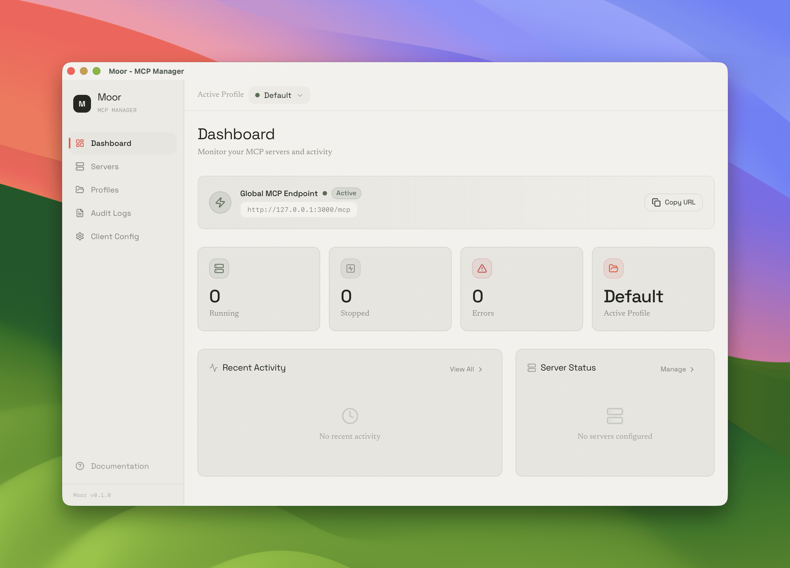

<p align="center">
  
</p>

<h1 align="center">Moor</h1>

<p align="center">
  <b>Local MCP Gateway Manager for AI Agents</b><br>
  Aggregate multiple MCP servers into a single endpoint, filter tools by Profile, and manage everything from a beautiful native UI.
</p>

<p align="center">
  
  
  
  
  
  
</p>

<p align="center">
  <a href="#install">Install</a> ·
  <a href="#quickstart">Quickstart</a> ·
  <a href="#features">Features</a> ·
  <a href="#architecture">Architecture</a> ·
  <a href="#development">Development</a> ·
  <a href="#api">API</a>
</p>

<p align="center">
  <b>English</b> ·
  <a href="README.zh.md">中文</a>
</p>

---

> _AI Agents need tools, but managing dozens of MCP servers across different clients is a mess. I wanted a single gateway that aggregates everything, filters by context, and keeps running in the background — all controllable from a beautiful native UI._
>
> _Moor exposes one endpoint (`http://127.0.0.1:<port>/mcp`) that dynamically serves only the tools you want, based on your active Profile. Switch profiles without disconnecting your Agent, and every tool call is audited. That's why I built it._

<p align="center">
  
</p>

## Install

### macOS App

Download the `.dmg` from [Releases](https://github.com/yourusername/moor/releases), drag to Applications, done. The app bundles the Node.js sidecar as a standalone binary — no pre-installed runtime required.

### Build from Source

Requires macOS (Apple Silicon / Intel), Node.js >= 20, pnpm >= 9, and Rust >= 1.77.

```bash
git clone https://github.com/yourusername/moor.git
cd moor
vp install
```

See [Development](#development) for build instructions.

## Quickstart

### Launch the App

Open **Moor.app**. The Dashboard shows your active Profile, server status, and recent audit logs at a glance.

### Scan Existing Configs

Moor can automatically detect MCP servers you've already configured for Claude Code and Cursor:

1. Go to **Servers** → **Import**
2. Click **Scan** — Moor reads `~/.claude/settings.json` and `.cursor/mcp.json`
3. Select the servers you want to import

### Create a Profile

Profiles let you group servers and control which tools are exposed to Agents:

1. Go to **Profiles** → **New Profile**
2. Name it (e.g., "Coding", "Research")
3. Toggle servers on/off
4. Expand a server to enable/disable individual tools
5. Click **Activate** — the change is instant

### Connect Your Agent

Point any MCP-compatible client to Moor's single endpoint:

```
http://127.0.0.1:9223/mcp
```

Moor handles the rest — aggregating `tools/list`, routing `tools/call`, and filtering based on your active Profile.

## Features

### MCP Gateway Aggregation

A single HTTP endpoint (`/mcp`) proxies all backend MCP servers. Agents see a unified tool catalog — no need to configure multiple endpoints.

### Multi-Transport Support

Connect to both **stdio** (subprocess) and **HTTP/SSE** MCP servers. Moor manages connection lifecycles, restarts, and health checks automatically.

### Profile Management

Create unlimited Profiles for different workflows. Each Profile stores:

- Which servers are enabled
- Which tools are disabled per server
- A global active state

Switch Profiles with **hot-swap** — connected Agents stay connected, and the next `tools/list` reflects the new configuration immediately.

### Tool-Level Toggles

Beyond server-level on/off, drill into any server to disable specific tools. Disabled tools disappear from the Agent's tool catalog in real time.

### Config Import

One-click import from:

- **Claude Code**: `~/.claude/settings.json`
- **Cursor**: `.cursor/mcp.json`

Manual entry is also supported for any stdio or HTTP server.

### Client Configuration

Generate ready-to-copy configuration snippets for Claude Code, Cursor, Codex, and OpenCode. Paste into your client and start using Moor immediately.

### Audit Logs

Every `tools/call` is recorded with:

- Timestamp, Profile, Server, Tool name
- Arguments (with sensitive data redaction)
- Result or error
- Duration and Agent info

Filter by time range, server, or tool. View aggregate statistics on the Dashboard.

### System Tray

Close the window — Moor keeps running in the macOS menu bar. The gateway stays alive, so your Agents never lose connection.

### Real-Time Status

Server status changes and Profile switches are pushed to the UI via SSE. No refresh needed.

## Architecture

<details>
<summary>Architecture Diagram</summary>

```
Moor.app
├── UI Layer          React + Vite + TypeScript + Tailwind CSS v4 + shadcn/ui
├── Desktop Layer     Tauri 2 / Rust
│   ├── Window management + tray icon
│   ├── macOS Keychain access
│   └── Sidecar process lifecycle management
├── Gateway Daemon    Node.js / TypeScript Sidecar (bundled as SEA standalone binary)
│   ├── MCP protocol gateway   POST /mcp — init, tools/list, tools/call
│   ├── Server management      stdio spawn + HTTP/SSE client
│   ├── Profile routing        Global active Profile, hot-swap
│   ├── Audit logging          Async batch write (500ms / 50 entries)
│   └── SSE push               Real-time status sync to WebView
└── Storage           SQLite (node:sqlite)
    ├── servers (configs, status)
    ├── profiles (server groups + tool toggles)
    └── audit_logs (tool calls, params, results, errors)
```

</details>

### Communication Flow

```
AI Agent ──HTTP──▶ POST /mcp ──▶ Moor Gateway ──stdio/HTTP──▶ MCP Servers
                              │
WebView ──fetch──▶ /api/* ────┘
WebView ◀──SSE──── /api/events
```

- **Business operations**: WebView → HTTP `fetch()` → Sidecar (Node.js)
- **System operations**: WebView → Tauri IPC → Rust (macOS Keychain, tray, window)

## Development

### Prerequisites

- macOS (Apple Silicon / Intel)
- [Node.js](https://nodejs.org) >= 20
- [pnpm](https://pnpm.io) >= 9
- [Rust](https://rustup.rs) >= 1.77
- [Xcode Command Line Tools](https://developer.apple.com/xcode/resources/)

### Install Dependencies

```bash
vp install
```

### Development Mode

Start both frontend and sidecar:

```bash
pnpm dev:all
```

- Frontend: http://localhost:1420
- Sidecar API: http://localhost:9223

Start the full desktop app (Tauri):

```bash
pnpm tauri dev
```

### Production Build

```bash
pnpm tauri build
```

Outputs:

- `src-tauri/target/release/bundle/macos/Moor.app`
- `src-tauri/target/release/bundle/dmg/Moor_0.1.0_aarch64.dmg`

### Code Quality

```bash
vp check       # format + lint + type check
vp lint        # lint only
vp lint --fix  # auto-fix
vp fmt         # format
```

### Testing

```bash
# Sidecar tests
pnpm --filter moor-sidecar test

# Frontend tests
vp test
```

## API

### MCP Gateway

| Method | Path   | Description                             |
| ------ | ------ | --------------------------------------- |
| `ALL`  | `/mcp` | MCP protocol endpoint (Streamable HTTP) |

### Server Management

| Method   | Path                     | Description          |
| -------- | ------------------------ | -------------------- |
| `GET`    | `/api/servers`           | List all servers     |
| `POST`   | `/api/servers`           | Add server           |
| `GET`    | `/api/servers/:id`       | Server detail        |
| `PUT`    | `/api/servers/:id`       | Update server config |
| `DELETE` | `/api/servers/:id`       | Remove server        |
| `POST`   | `/api/servers/:id/start` | Start server         |
| `POST`   | `/api/servers/:id/stop`  | Stop server          |
| `GET`    | `/api/servers/:id/tools` | Get discovered tools |

### Profile Management

| Method   | Path                             | Description                           |
| -------- | -------------------------------- | ------------------------------------- |
| `GET`    | `/api/profiles`                  | List all profiles                     |
| `POST`   | `/api/profiles`                  | Create profile                        |
| `PUT`    | `/api/profiles/:id`              | Update profile                        |
| `DELETE` | `/api/profiles/:id`              | Delete profile                        |
| `PUT`    | `/api/profiles/:id/activate`     | Set as active profile                 |
| `PUT`    | `/api/profiles/:id/servers/:sid` | Update server toggle + disabled tools |

### Audit Logs

| Method | Path              | Description               |
| ------ | ----------------- | ------------------------- |
| `GET`  | `/api/logs`       | Query logs (with filters) |
| `GET`  | `/api/logs/stats` | Aggregate statistics      |

### Other

| Method | Path                  | Description                |
| ------ | --------------------- | -------------------------- |
| `GET`  | `/api/health`         | Health check               |
| `GET`  | `/api/runtime`        | Runtime info (port, URL)   |
| `GET`  | `/api/events`         | SSE real-time event stream |
| `POST` | `/api/import/scan`    | Scan local client configs  |
| `POST` | `/api/import/execute` | Execute import             |

## Tech Stack

| Layer         | Technology                                        |
| ------------- | ------------------------------------------------- |
| Frontend      | React 19, Vite 6, TypeScript 5.7, Tailwind CSS v4 |
| UI Components | shadcn/ui (New York style)                        |
| Desktop       | Tauri 2 (Rust)                                    |
| Sidecar       | Node.js, TypeScript, Hono, @hono/node-server      |
| Database      | SQLite (node:sqlite)                              |
| MCP Protocol  | @modelcontextprotocol/sdk (stdio + HTTP/SSE)      |
| Icons         | Lucide React                                      |
| Tooling       | Vite+ (vp CLI), Oxlint, Oxfmt, Vitest             |

## Acknowledgements

Thanks to the [linuxdo](https://linux.do/) community for discussion, sharing, and feedback.

## ❤️ Sponsor

[](https://ko-fi.com/varandrew)

## 🌟 Star History

[](https://www.star-history.com/#varandrew/moor&Date)

## License

[MIT](LICENSE)
